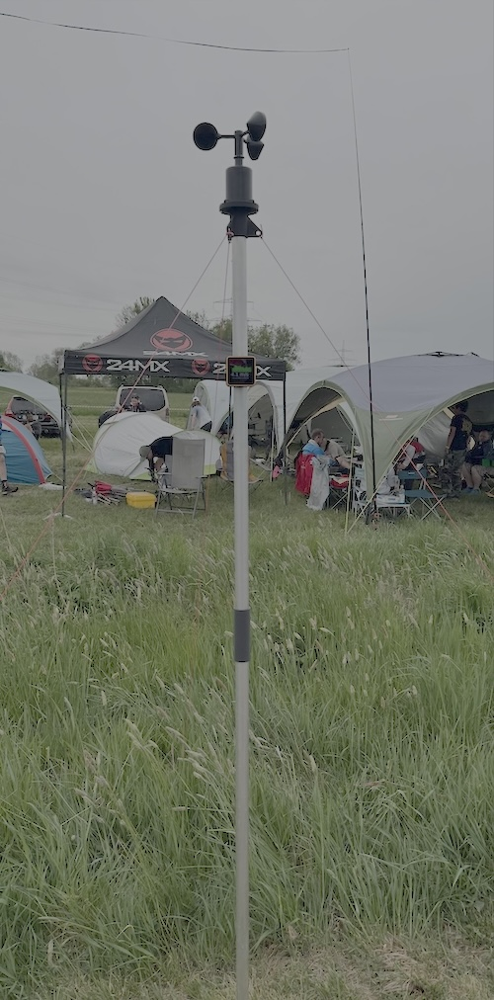
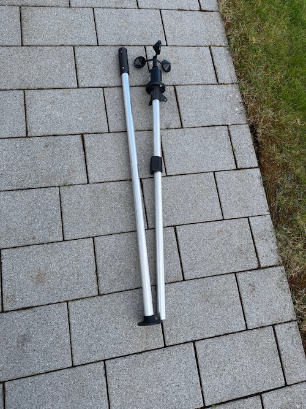

# FxWind

FxWind is a wind measurement tool for FAI Aeromodeling contests. In the FAI rules for 
different contest classes like F3B, F3J, F3K, etc. there are defined rules under which wind
conditions a contest can take place and under wich conditions a contest has to be 
interrupted. FxWind will help you to comply with these competition rules.

All HW and SW Parts are published as open source and could be used to build your own measurement
tool. 

Feel free to open an issue or participate in the development by opening a pull request.

# Features

- [x] Battery powered. Last one complete competition day of  at least 10 hours
- [x] Recharchable by USB-C in 2-3 hours
- [x] Additional Backup Power by USB-C
- [x] Magnetic connection between sensor and display, no wiring
- [x] 3D Printed parts for Microcontroller and accessories
- [x] Simple Alloy tube as base rig
- [x] Waterproof
- [x] Logging of Windspeed and Datetime on SD-Card for auditabilty, traceabiliy and possible complaints
- [x] 1s Sampling rate 
- [x] Wifi or Accesspoint connection to display the windspeed conditions on a webpage
- [x] Time synchronisation with NTP server and local backup of date and time with a Real Time Clock (RTC) 
- [x] Touch display with current windspeed and the needed ranges
- [x] Visualisation of regions in the time plot where the wind thresholds has exceeded
- [x] Accustic alarm if the condition are met to interrupt a contest

# How to use

You can find the operation manual on the following link
[Operation Manual](docs/OperationManual.md)

# Setup

## Mechanical setup

The windspeed sensor and the controller with display are mounted on a alloy tube which has the specified height of 2m above the ground. The original controller case of the M5Tough device is replaced by a 3D printed part which contains the rechargeable battery, the magnetic connector, the USB-C port and the magnetic Pogo Pin connector for the electric connection to the wind sensor. The controller and USB-C Port is sealed with an O-ring to ensure the waterproof design. The alloy tube is splitted into two parts for better transportability and could be sticked together with a tube connector. 

### CAD, STL Files 

## Electronic setup

### Wiring

## BOM

| Part                           | Quantity | Description                                                 | Link                                                |
| ------------------------------ | -------- | ----------------------------------------------------------- | --------------------------------------------------- |
| M5Tough                        | 1        | Microcontroller with Touchscreen                            | https://docs.m5stack.com/en/core/tough              |
| 1S 2000mAh Lipo                | 1        |                                                             | https://www.amazon.de/dp/B08TQSC5G9                 |
| Magnet                         | 1        | Magnet for connection between Controller and Base rig       | https://www.amazon.de/dp/B0BKWQX36P                 |
| Windspeed Sensor               | 1        | Windspeed sensor with impuls output and connection wiring   | https://www.amazon.de/dp/B0C2F5MGKZ                 |
| Magnetic 3pin Pogo connector   | 1        | Connection between Controller case and Base rig             | https://www.amazon.de/dp/B0B1771YT4                 |
| USB-C Port                     | 1        | USB-C Port for SW upload and as input for battery charge    | https://www.amazon.de/dp/B0CZHDMFLZ                 |
| Ruthex M3S Brass Threads       | 6        | M3 Short Brass inserts for meltin into the 3D Printed parts | https://www.amazon.de/dp/B09ZHSGHXD                 |
| M3x10 Flathead screw           | 4        | Threads for clamp                                           |                                                     |
| M3x6 countersunk screw         | 2        | Threads for securing the magnet and the metal plate         |                                                     |
| Alloy tube 30mm diameter       | 2m       | Base rig, 2x 1m length                                      |                                                     |
| Base socket for Alloy tube     | 1        | 3D printed part                                             | [Base socket](construction/BottomStand.stl)         |
| Windsensor socket              | 1        | 3D printed part                                             | [Windsensor socket](construction/TopStand.stl)      |
| Controller case                | 1        | 3D printed part                                             | [Controller case](construction/FxWind_Case.stl)     |
| Base plate for controller case | 1        | 3D printed part                                             | [Base plate](construction/FxWind_ClampCase.stl)     |
| Clamp                          | 1        | 3D printed part                                             | [Clamp](construction/FxWind_Clamp.stl)              |
| Tube connector                 | 1        | 3D printed part                                             | [Tube connector](construction/FxWind_Connector.stl) |

## Assembly

You can find the assembly instructions on the following link
[Assembly Instructions](docs/assembly.md)

## Software

The software is based on the Arduino framework and is build, using the PlatformIO develompent environment.

### Setup LittleFS Filesystem

For html File, follow this tutorial https://randomnerdtutorials.com/esp32-vs-code-platformio-littlefs/

# Ideas and open issues

* Store snapshot if interruption criteria is reached
* BLE connection 

# Appendix

## FAI rule links

FAI Sporting code rc modeling soaring 
https://www.fai.org/sites/default/files/sc4_vol_f3_soaring_25.pdf

## Extracts

Extracts of the sporting codes of different FAI competition categories

### CIAM General rules

> C.17.2 Interruption
> a) The contest should be interrupted or the start delayed by the contest director in the following
> circumstances and in other exceptional circumstances decided by the contest director:
> i) Unless specified otherwise in the rules for a category or a particular class, the wind is
> continuously stronger than **12 m/s** measured **at two (2) metres** above the ground at the starting
> line (flight line), **for at least one minute**

### Soaring F3B

> F3B.1.11. Weather Conditions / Interruptions
> a) The maximum wind speed for F3B contests is twelve (12) m/sec. The > contest has to be interrupted
> or the start delayed by the contest director if the wind speed exceeds > twelve (12) m/sec measured three (3)
> times for at least twenty (20) seconds in a time interval of five (5) > minutes two (2) metres above the ground
> at the start and landing area.

### Soaring F3F

> F3F.1.17. Weather Conditions and interruptions
> A round in progress must be interrupted if:-
> The wind speed is below three (3) m/sec or more than twenty-five (25) m/> sec for at least twenty (20)
> a) seconds.
> b) The direction of the wind deviates more than 45º from a line > perpendicular to the main direction of
> the speed course for at least twenty (20) seconds.
> The wind speed and wind direction are measured with the equipment of the > organiser at a representative
> position and height chosen from the experience of the organiser.

### Soaring F3G

> F3G.1.12. Weather Conditions/Interruptions
> a) The maximum wind speed for F3G contests is twelve (12) m/sec. The > contest has to be interrupted
> or the start delayed by the contest director if the wind speed exceeds > twelve (12) m/sec measured three (3)
> times for at least twenty (20) seconds in a time interval of five (5) > minutes two (2) metres above the ground
> at the start and landing area.

### Soaring F3J

> F3J.12. WEATHER CONDITIONS AND INTERRUPTIONS
> The maximum wind speed for F3J contests is twelve (12) m/sec two (2) m > above the ground at the centre of
> the launch corridor. The start of the contest must be delayed or the > contest has to be interrupted by the
> contest director if the wind speed exceeds twelve (12) m/sec measured > three (3) times for at least twenty
> (20) sec in a time interval of five (5) minutes at the start and landing > area.

### Soaring F3K

> F3K.5. WEATHER CONDITIONS / INTERRUPTIONS
> The maximum wind speed for F3K contests is eight (8) m/sec. The start of > the contest must be delayed or
> the contest has to be interrupted by the contest director if the wind > speed exceeds eight (8) m/sec measured
> three (3) times for at least twenty (20) sec in a time interval of five > (5) minutes at two (2) metres above the
> ground at the start and landing field. In the case of rain, the contest > director can interrupt the contest. When
> the rain stops, the contest starts again with the group that was flying, > which receives a re-flight.

### Soaring F3L

> F3L.6 Interruptions
> a) The Contest Director has the right to interrupt the competition and > relocate the starting line
> when the wind direction deviates too much or becomes a tailwind.
> b) The competition shall be interrupted by the Contest Director if the > wind is continuously
> stronger than eight (8) m/s measured at two (2) metres above the ground > at the starting line (flight
> line), for at least one minute.

### Helicopter

> INTERRUPTION OF A COMPETITION
> If the wind component perpendicular to the flight line exceeds 8ms/s for > a minimum of 20 seconds
> during a flight, the competition must be interrupted. The flight will be > repeated and the competition
> continued as soon as the wind subsides below the criterion. If the wind > does not subside before the
> round is completed, the entire round will be dropped. The determination > will be made by the organiser
> with concurrence of the FAI Jury.

### Free flight

> F1.5 INTERRUPTION OF A CONTEST
> F1.5.1 Wind speed
> The interruption of contests is defined in CIAM General Rules C.17.2. > For Free Flight contests the
> contest should be interrupted when the wind measured at 2 metres above > the ground at the starting
> line is stronger than 9 m/s for at least 20 seconds.

### Control line

> 4.0.1 INTERRUPTION OF THE CONTEST
> Wind stronger than 9 m/s for at least 30 seconds (instead of 12 m/s for > at least one minute in
> CIAM General Rules).

