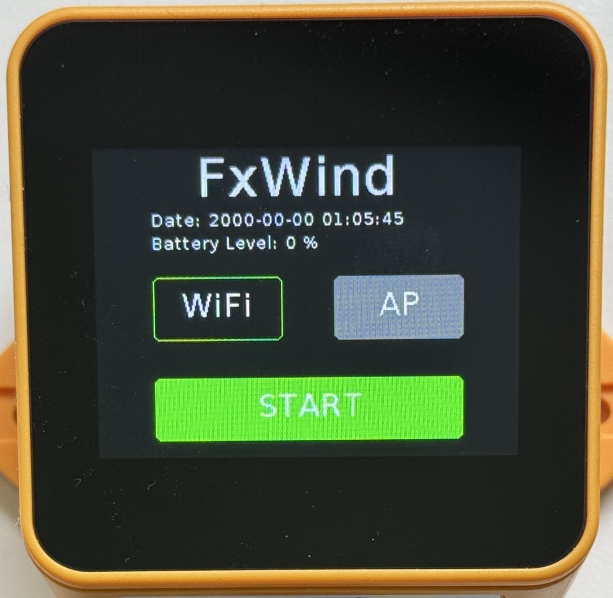
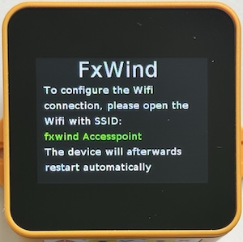
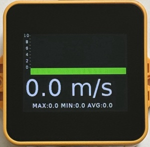
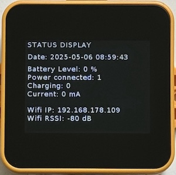
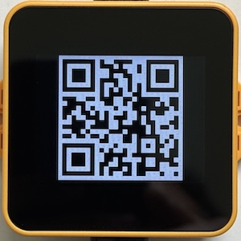
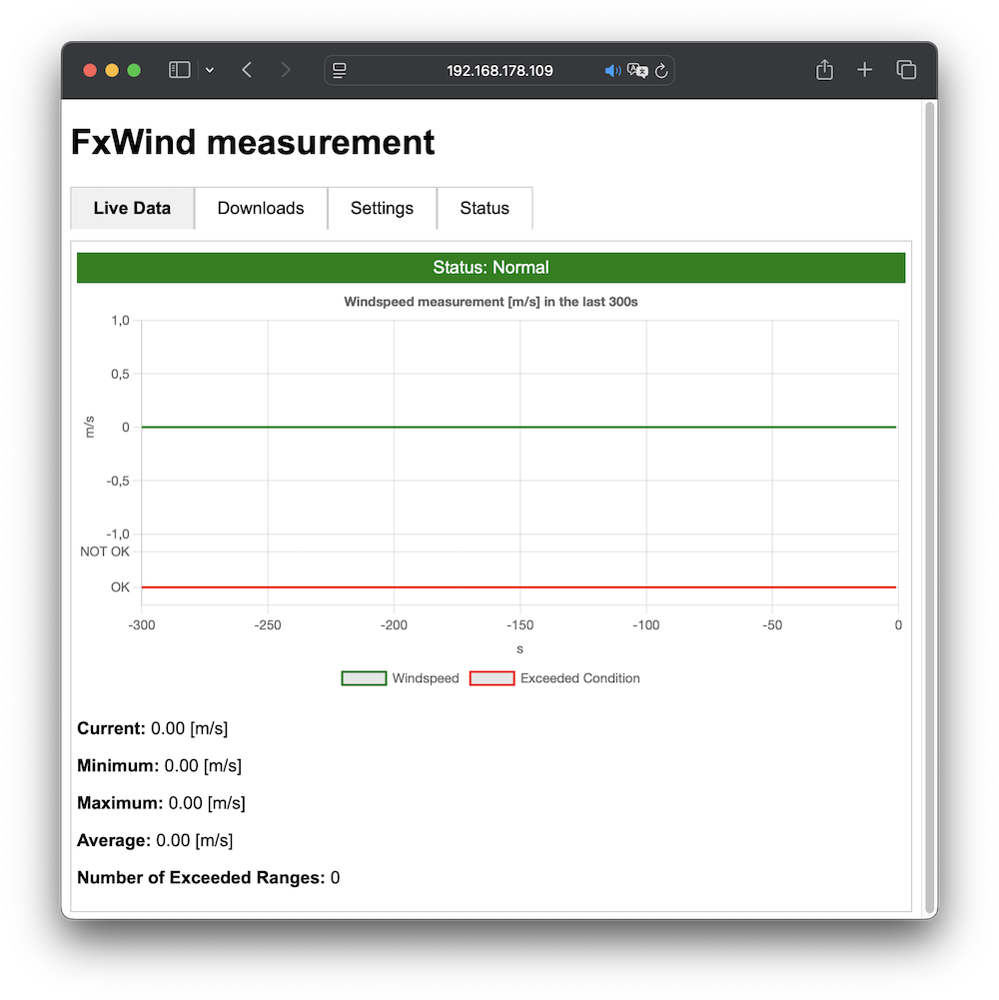
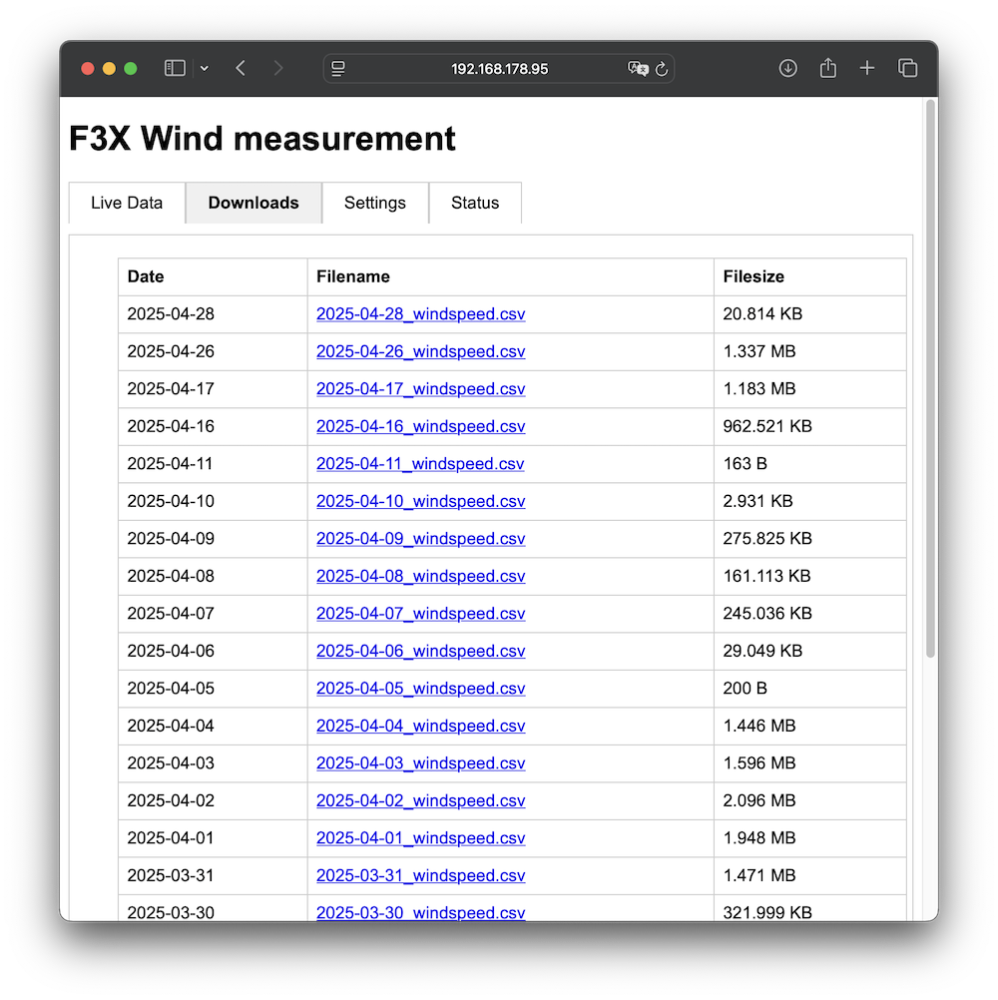
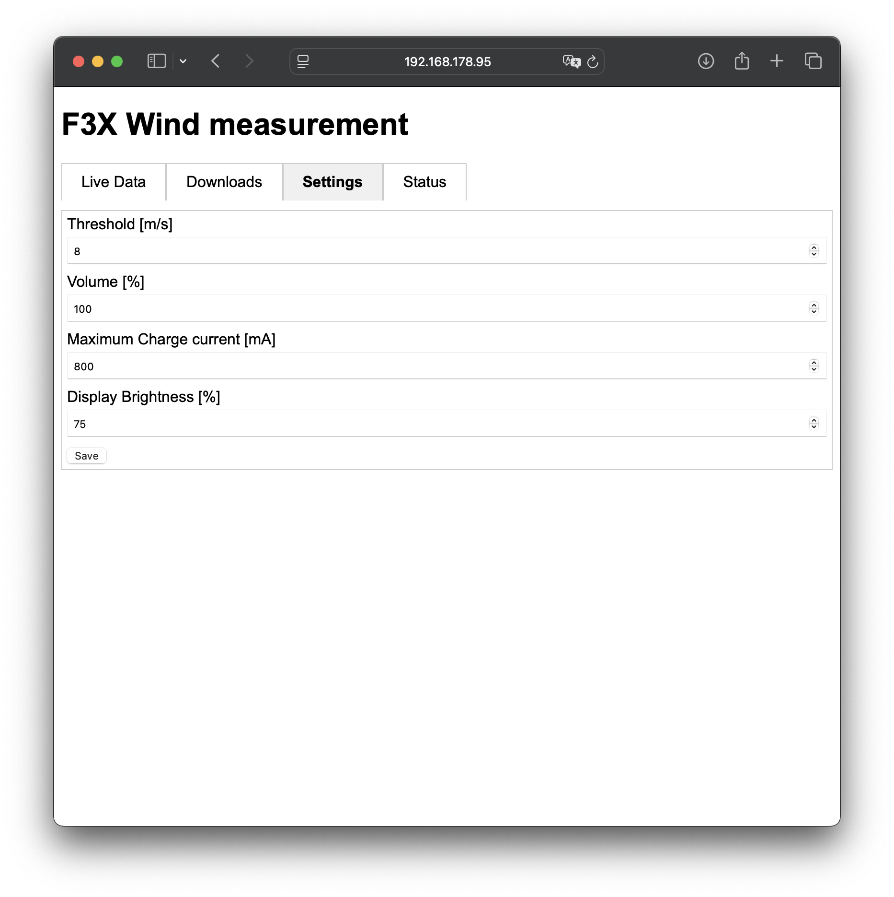
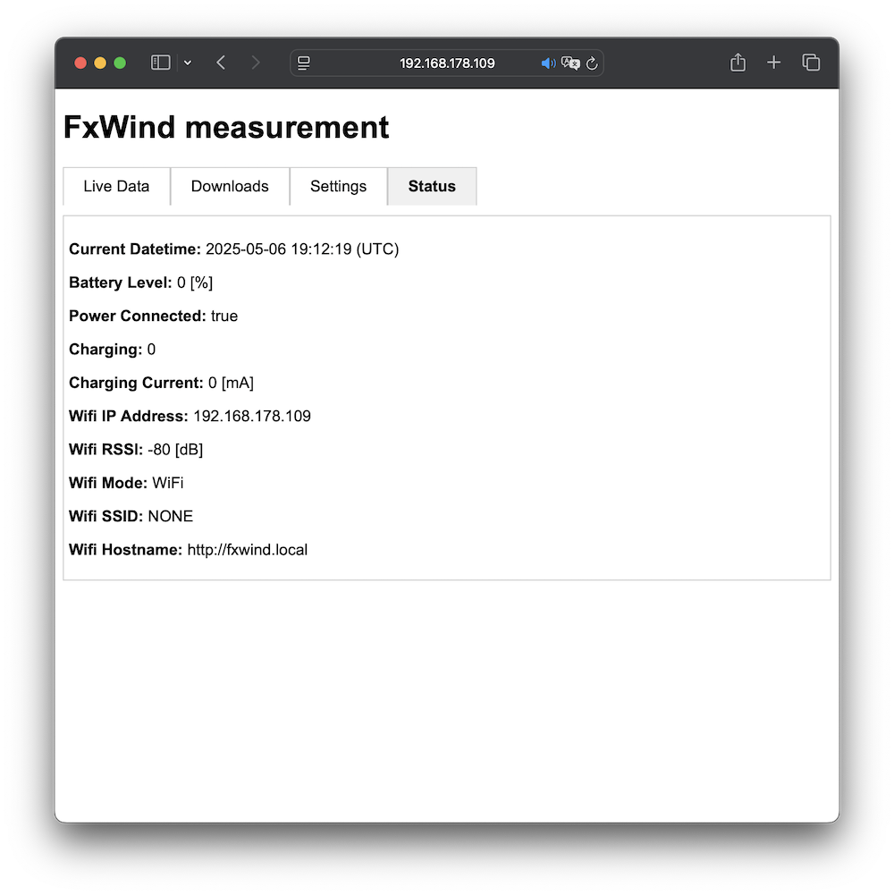

# FxWind Operation Manual

## Power on/off
To power on the device, just tap the screen. A short startup sound is played. To power off the device you have to press and hold the touchscreen for at least 3 seconds. If the three seconds are reached, a short shutoff sound is played and you can release your touch.

## Charging

To charge the device, you have to use a USB-A to USB-C cable. Unfortuntately a USB-C to USB-C cable does not work. Charging will start immedieately after you have plugged in the USB cable. It will stop automatically if the Battery is fully charged. If the device is switched on, you can see the charging current and the battery level in the status screen. In the web view, you can configure the maximum charging current. The default setting is 800mA max charge current. This will give you a full battery after 2-3 hours.

## Operation Modes

After the startup of the device you can select different operation modes which will be explained in the next sections.

### Standalone Mode

In the standalone mode the Real time clock of the device is used to store data on the SD card. This mode is always available and has no need of a local Wifi connection. This is the least power consuming mode but will not display data in a browser view. Only the device integrated display will be used.

### Wifi Mode

In Wifi Mode, the device will try to connect to a local available Wifi  network. The webpage with the measurment data will be available on a local IP address of that WiFi network. 

To configure the Wifi Mode, the display will show you the hint to open the  Accesspoint "**fxwind Accesspoint**". 

The accesspoint will automatically open a webpage where you can choose your Wifi network to which you want to connect and you can enter the password for that Wifi network. After storing the settings, the device will automatically try to connect to the configured Wifi network and will store the settings for the next startup of the device. Once configured, you have not to enter the credentials again.

After a valid configuration, you can acccess the webpage of the device in the lokal Wifi network with entering the following address in your browser: [fxwind.local](fxwind.local)

Alternatively, the device will show up a QR code with the address and you can scan that code with your mobile phone. Just swipe through on the display several times till a QR code is presented.

### Accesspoint (AP) Mode

The accesspoint mode will also serve a webpage with the display of the current measurement data. But it will not need a connection to a local Wifi network. Instead it provides an accesspoint where a Wifi device could be connected to. 

## Display usage

The display is a touch display which supports the following gestures

### Swipe (left/right)

After the Startup screen, you are in the main screen mode of the device and here you can use left and right swipe gestures to switch between different screens.

### Single press
Will switch ON the device

### Long press > 3s
Will shut OFF the device

### Double tap
Will switch off the Alarm sound 

## Different Displays

### Combined/Default Screen

### Status Screen

### QR Code Screen

## Alerts

If the FAI condition to interrupt th competition is reached, a sound alarm is activated which has to be confirmed manually by double tap on the display.

## Webpage

If you have enabled Wifi or AP Mode, you are able to see the visualization of the measurement values online. After you have connected your device to the Wifi or to the accesspoint, you can reach the webpage with the http://fxwind.local link.

The webpage ist structured in the following tabs:

### Live Data
In the *Live Data* tab, you can have an overview of the current wind speed, the wind speed in the past 300 seconds and the status:

| Color      | Status                                                                                                                                                        |
| ---------- | ------------------------------------------------------------------------------------------------------------------------------------------------------------- |
| **GREEN**  | Windspeed has not reached threshold for longer than 20 seconds in the last 300 seconds                                                                        |
| **YELLOW** | Windspeed has at least once reached the threshold for longer than 20 seconds in the last 300 seconds                                                          |
| **RED**    | Windspeed has reached at least 3 times the threshold for longer than 20 seconds in the last 300 seconds --> FAI rule for interruption of competion is reached |

### Downloads

In the *Download* tab you can see the list of all available *.csv files on the SD-Card. One file is generated per day. If you press the link of the file, a download will start and you can open the file on your local computer.

### Settings

In the *Settings* tab you can change the following configuration parameters

| Setting                     | Description                                             |
| --------------------------- | ------------------------------------------------------- |
| Lower Threshold [m/s]             | Lower FAI wind threshold 0..5 m/s                            |
| Upper Threshold [m/s]             | Upper FAI wind threshold 2..25 m/s                            |
| Duration of Window [s]             | Duration, how long the windspeed should be inside thresholds 10..120 s                            |
| Number of Windows           | Number of windows which should be reached for contest abortion 1..10                            |

| Volume [%]                  | Speaker volume 0..100%                                  |
| Maximum Charge current [mA] | Maximum charge current 100..1000 mA for 2000mAh battery |
| Display Brightness [%]      | Display background brightness level 0..100%             |

By pressing one of the FAI Category buttons, the default values for that category out of the FAI Rules are updated in the fields. You have to press Save to apply the settings.

To reset/erase the saved WiFi settings, you can press the lower button.

### Status

In the *Status* tab you can see the current status values of the device.

