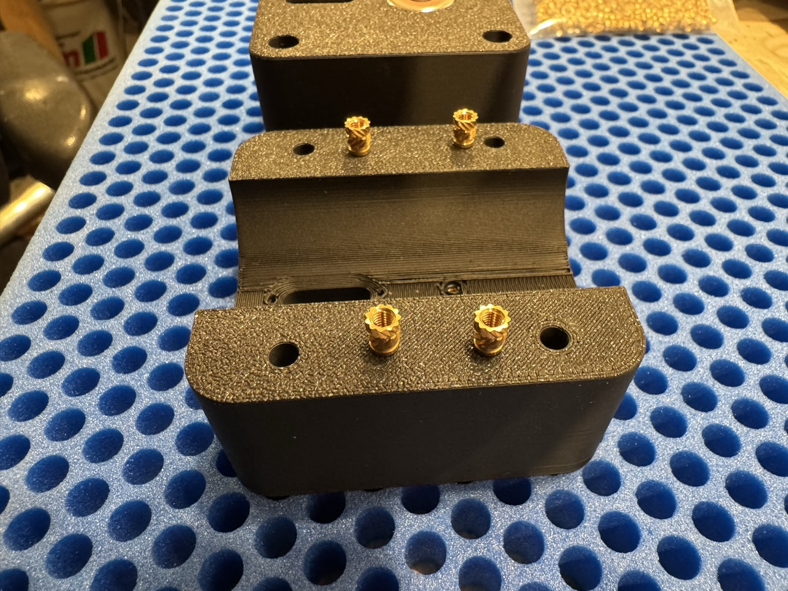
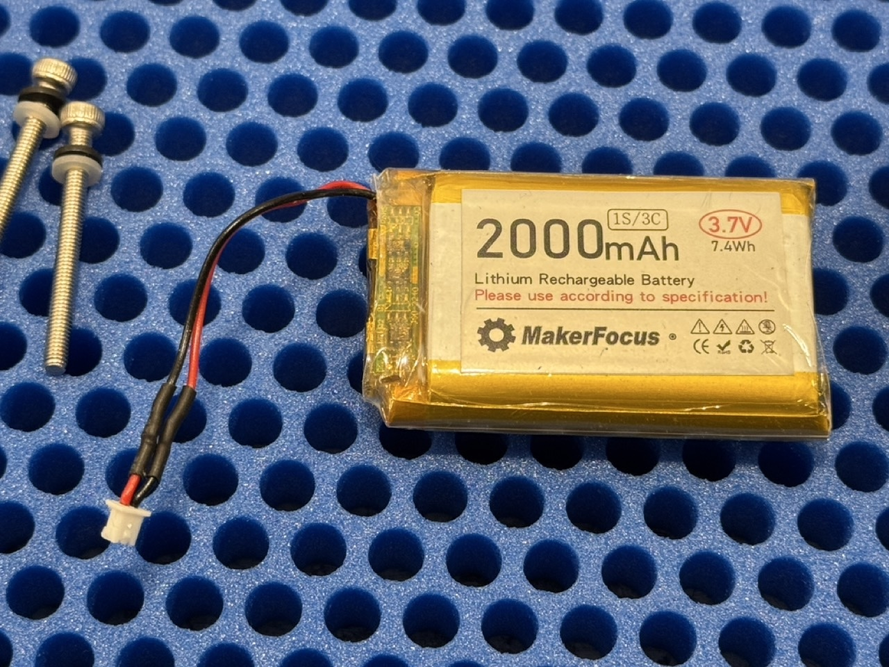
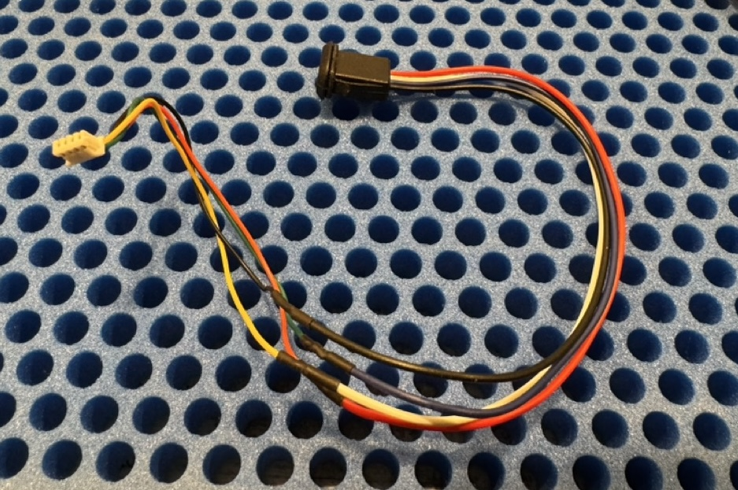
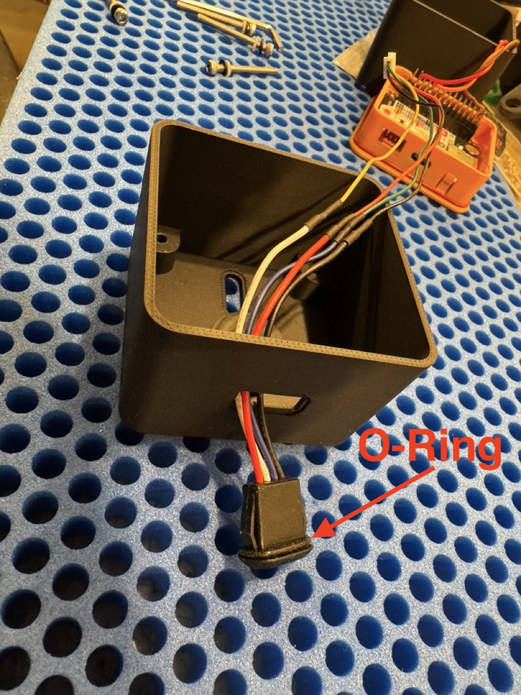
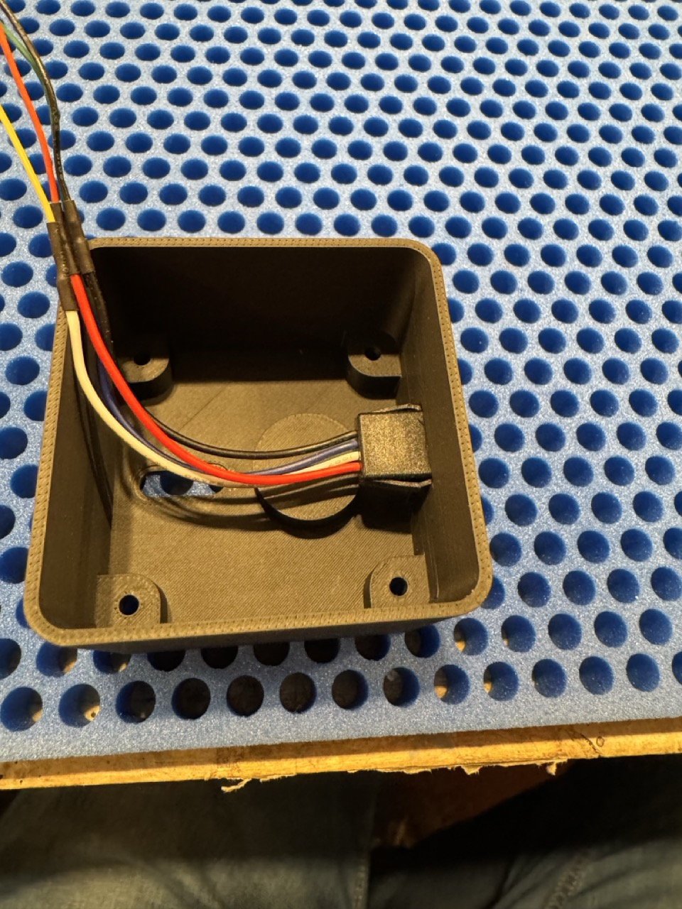
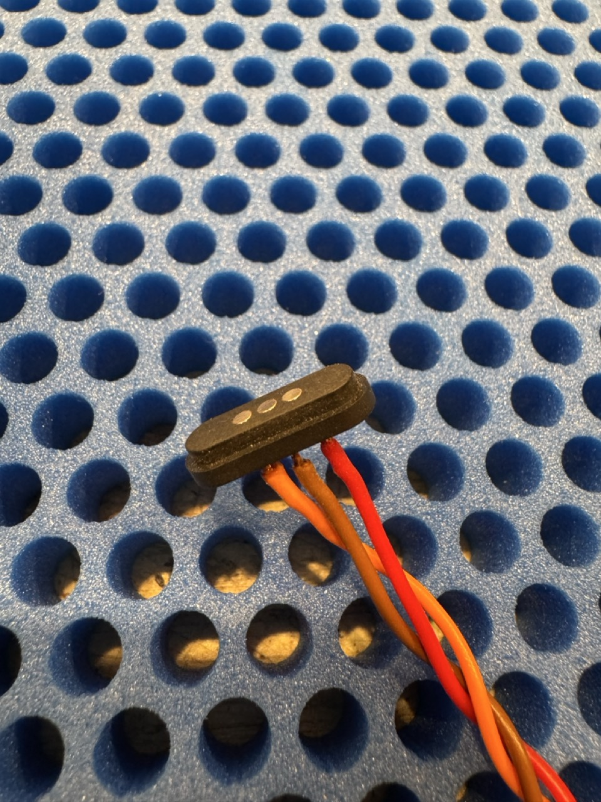
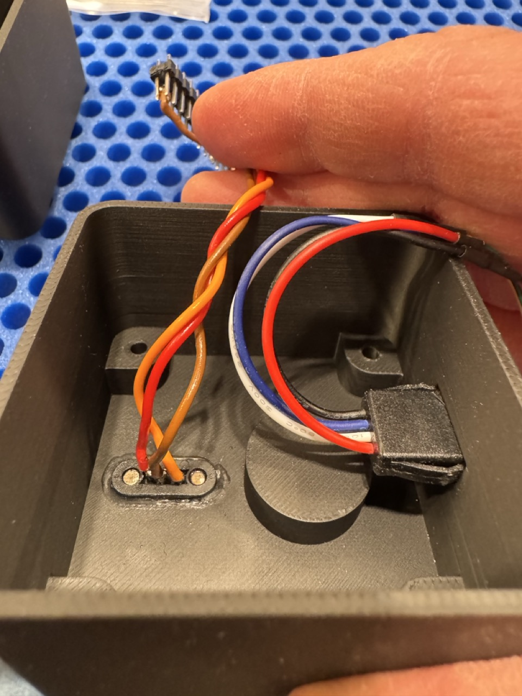
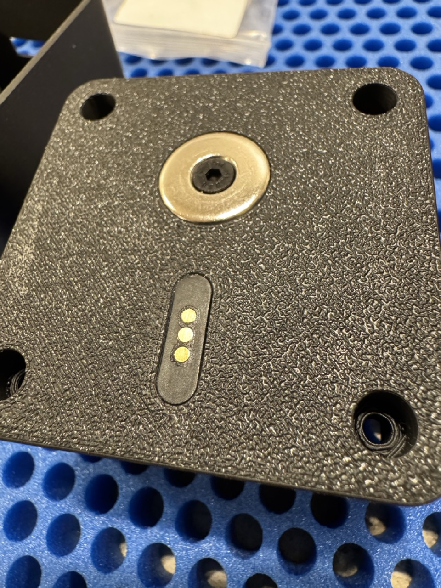

# Assembly

After you have ordered and printed all the materials on the BOM, you can start the assembly of the measurement device. 

## Brass threads

To mount the magnet we have to melt 2 Ruthex M3S Brass Threads into the controller body and the clamp body. Additionally we have to melt 4 Ruthex M3 Brass Threads into the clamp body

## Magnet
The magnet and spacer is mounted with two M3x6 countersunk screws. The magnet is part of the clamp body and the spacer is part of the countroller body.

## Battery 
The Battery out of the BOM is unfortunately delivered with a connector with the wrong polarity. So pay **ATTENTION** to solder the connector with the opposite polariy. Plus and Minus pole are marked on the controller board. Please check the polarity before connect the battery to the controller board. The battery connector should look as follows

## USB cable
The USB cable which is used for charging the battery and flashing the software on the controller should be soldered together with the following mapping. 

| USB female plug | M1250V-04P connector | Pin |
| ---- | -------- | -------|
| black | black | GND |
| red | red | +5V |
| white | yellow | D- |
| blue | green | D+ |

The soldered cable should look as follows

After soldering the cable can be inserted into the controller case. Use an O-ring (seal ring) on the USB female plug before inserting the plug into the case. You have to apply a decent amount of pressure to "click" the plug into the case. 

## POGO Pin connectors
The connection between controller case and the windspeed sensor itself is done with a 3pin magnetic POGO connector. The connector is soldered and glued into the controller case.

